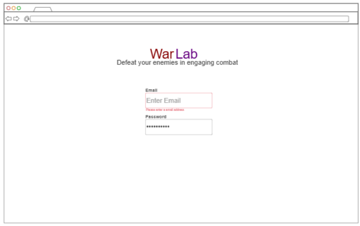
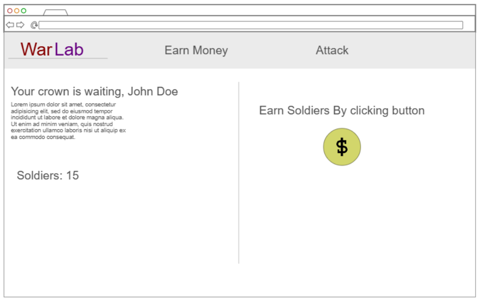
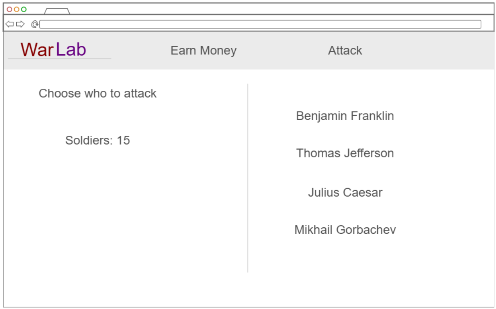
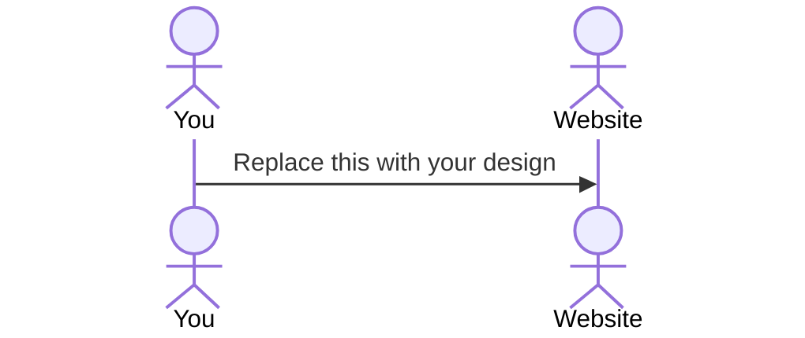

# WarLab

[My Notes](notes.md)

WarLab is an ultra competetive game where players compete to see who can beat each other. 

> [!NOTE]
>  This is a template for your startup application. You must modify this `README.md` file for each phase of your development. You only need to fill in the section for each deliverable when that deliverable is submitted in Canvas. Without completing the section for a deliverable, the TA will not know what to look for when grading your submission. Feel free to add additional information to each deliverable description, but make sure you at least have the list of rubric items and a description of what you did for each item.

> [!NOTE]
>  If you are not familiar with Markdown then you should review the [documentation](https://docs.github.com/en/get-started/writing-on-github/getting-started-with-writing-and-formatting-on-github/basic-writing-and-formatting-syntax) before continuing.

## 🚀 Specification Deliverable

> [!NOTE]
>  Fill in this sections as the submission artifact for this deliverable. You can refer to this [example](https://github.com/webprogramming260/startup-example/blob/main/README.md) for inspiration.

For this deliverable I did the following. I checked the box `[x]` and added a description for things I completed.

- [X] Proper use of Markdown
- [X] A concise and compelling elevator pitch
- [X] Description of key features
- [X] Description of how you will use each technology
- [X] One or more rough sketches of your application. Images must be embedded in this file using Markdown image references.

### Elevator pitch

Have you ever gotten into an argument where you are correct and everyone else is wrong? There is now a solution. WarLab is a free, hands on experience designed to allow users to compete with each other in a meaningful way. This interactive platform allows users to practice wartime strategies and create intricate strategies to ultimately become the victor. This platform provides a method to resolve conflicts and more importantly allows us to find the supreme leader of Earth

### Design

WarLab is a strategy game about spending your soldiers wisely and clicking very fast.

When a user creates an account, they will be given a fixed number of soldiers as their total life. 

On the landing page, users will be able to see their current number of troops as well as tasks that allow them to build up their army.

On the attack page, users can spend some of their troops to eliminate other players

### Key features

- Secure login over HTTPS
- The feature to select a name for your kingdom
- Ability to earn soldiers by participating in tasks such as clicking a button
- Ability to attack another kingdom
- Ability to defeat a kingdom and earn extra soldiers
- A win screen for the last player standing
- persistently stored game data

### Technologies

I am going to use the required technologies in the following ways.

- **HTML** - There will be three pages that are structured in a smart and accessible way. One page for logging in, one for earning troops, and one for attacking other kingdoms.
- **CSS** - Style an appealing website with simple animations and a complementary color scheme, and provide support for a wide range of screen sizes.
- **React** - Provide reactive web components, display important data, manage state, and perform simple logic.
- **Service** - A Node.Js backend handling logic for logins and interactions between players
- **DB/Login** - MongoDB database for storing users and important info such as their kingdom title and number of troops
- **WebSocket** - Players are notified when they are attacked by other players

## 🚀 AWS deliverable

For this deliverable I did the following. I checked the box `[x]` and added a description for things I completed.

- [X] **Server deployed and accessible with custom domain name** - [My server link](webprogramming260startup.click).

## 🚀 HTML deliverable

For this deliverable I did the following. I checked the box `[x]` and added a description for things I completed. I
- [X] **HTML pages** - I have four four HTML pages.
- [X] **Proper HTML element usage** - Use tables, headers, footers, and nav properly.
- [X] **Links** - I have links to different pages and to my Github account.
- [X] **Text** - I have an about page with some text.
- [X] **3rd party API placeholder** - I will use an API to retrieve images.
- [X] **Images** - I use several cool images in my HTML.
- [X] **Login placeholder** - I have login inputs and labels on my home page.
- [X] **DB data placeholder** - Username, Password, Kingdom name, and Kingdom background will be stored in database.
- [X] **WebSocket placeholder** - Recieve updates in real time about how many soldiers people have.

## 🚀 CSS deliverable

For this deliverable I did the following. I checked the box `[x]` and added a description for things I completed.

- [X] **Header, footer, and main content body** - I have a header with a navbar, a footer with my github link, and a main section for the page content.
- [X] **Navigation elements** - I have a navbar with buttons for navigation.
- [X] **Responsive to window resizing** - I made sure that all elements look good down to screen sizes of 250px.
- [X] **Application elements** - I use several different elements to make my page appealing and navigable.
- [X] **Application text content** - I styled my text content to fit well and changed the font to look nicer.
- [X] **Application images** - I use several images sized to a reasonable scale.

## 🚀 React part 1: Routing deliverable

For this deliverable I did the following. I checked the box `[x]` and added a description for things I completed.

- [X] **Bundled using Vite** - I use Vite to bundle my application.
- [X] **Components** - I have a component for every page as well as header and footer components.
- [X] **Router** - Routing between all of my pages.

## 🚀 React part 2: Reactivity

For this deliverable I did the following. I checked the box `[x]` and added a description for things I completed.

- [X] **All functionality implemented or mocked out** - I mocked all of the api services so I can easily connect them. I created all of the game logic and tested it.
- [X] **Hooks** - As instructed, I made good use of React's useState and useEffect hooks. For this project, I also used React's context API to share state between components

## 🚀 Service deliverable

For this deliverable I did the following. I checked the box `[x]` and added a description for things I completed.

- [ ] **Node.js/Express HTTP service** - I did not complete this part of the deliverable.
- [ ] **Static middleware for frontend** - I did not complete this part of the deliverable.
- [ ] **Calls to third party endpoints** - I did not complete this part of the deliverable.
- [ ] **Backend service endpoints** - I did not complete this part of the deliverable.
- [ ] **Frontend calls service endpoints** - I did not complete this part of the deliverable.

## 🚀 DB/Login deliverable

For this deliverable I did the following. I checked the box `[x]` and added a description for things I completed.

- [ ] **User registration** - I did not complete this part of the deliverable.
- [ ] **User login and logout** - I did not complete this part of the deliverable.
- [ ] **Stores data in MongoDB** - I did not complete this part of the deliverable.
- [ ] **Stores credentials in MongoDB** - I did not complete this part of the deliverable.
- [ ] **Restricts functionality based on authentication** - I did not complete this part of the deliverable.

## 🚀 WebSocket deliverable

For this deliverable I did the following. I checked the box `[x]` and added a description for things I completed.

- [ ] **Backend listens for WebSocket connection** - I did not complete this part of the deliverable.
- [ ] **Frontend makes WebSocket connection** - I did not complete this part of the deliverable.
- [ ] **Data sent over WebSocket connection** - I did not complete this part of the deliverable.
- [ ] **WebSocket data displayed** - I did not complete this part of the deliverable.
- [ ] **Application is fully functional** - I did not complete this part of the deliverable.
